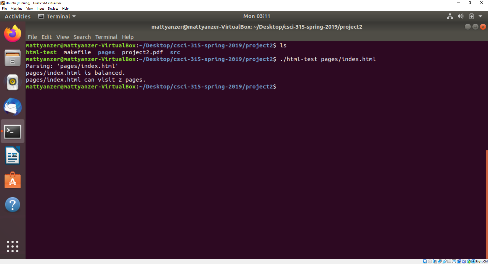

Portfolio
=========

Programming Projects
--------------------

*For access to my private project repositories, please [email me](mailto:mcyanzer@csustudent.net?subject=GitHub%20Access) with the subject line, GitHub Access.

---
### [Website for Marathon Run Event | CSCI 334](project1)

---
### [HTML Tag Matcher | CSCI 315](project2)

---
### [Personal Website | CSCI 332](project3)

---
### [Hypotenuse Calculation | CSCI 301](project4)

---

Ethics Papers
-------------

### [Ethics Paper for System Analysis and Software Design](Ethics paper.docx)

-   **Class:**  CSCI 325
-   **Grade:**  A

### [Ethics Paper for Operating Systems](Ethics Paper Operating Systems.docx)

-   **Class:**  CSCI 431
-   **Grade:**  A

### [Ethics Paper for Computer Architecture](Ethics Paper Computer Architecture.docx)

-   **Class:** CSCI 330
-   **Grade:** A

---

Presentations
-------------

### [Presentation on Target Security Breach](/pdf/Presentation1.pdf)

- **Class:** CSCI 301
- **Grade:** A

### [Presentation on Full Adder](/pdf/Presentation2.pdf)

- **Class:** CSCI 330
- **Grade:** A

---

Page template forked from <a href="https://github.com/csu-cs/csci-portfolio">CSU-CS</a>

<!-- Remove above link if you don't want to attributive -->
