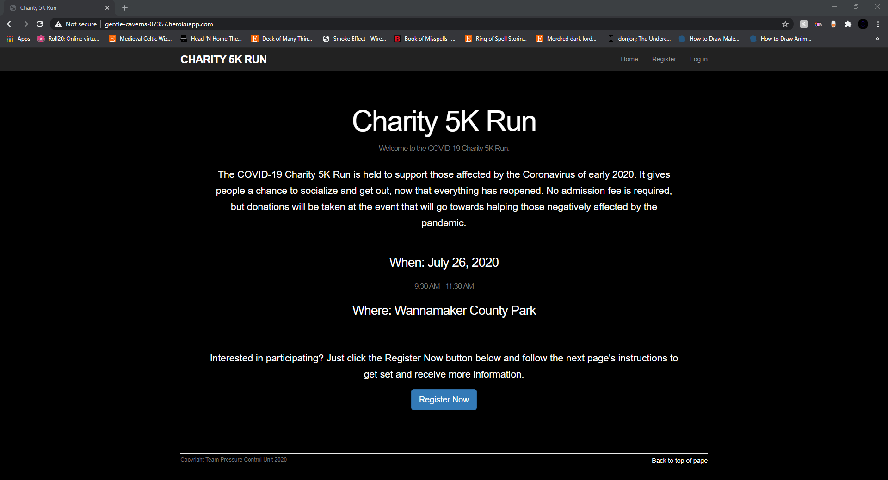
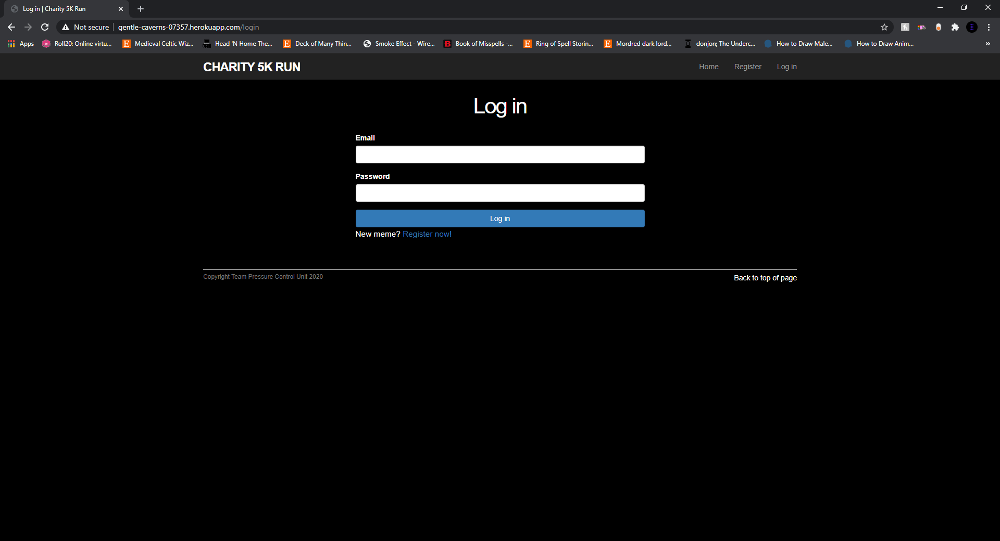
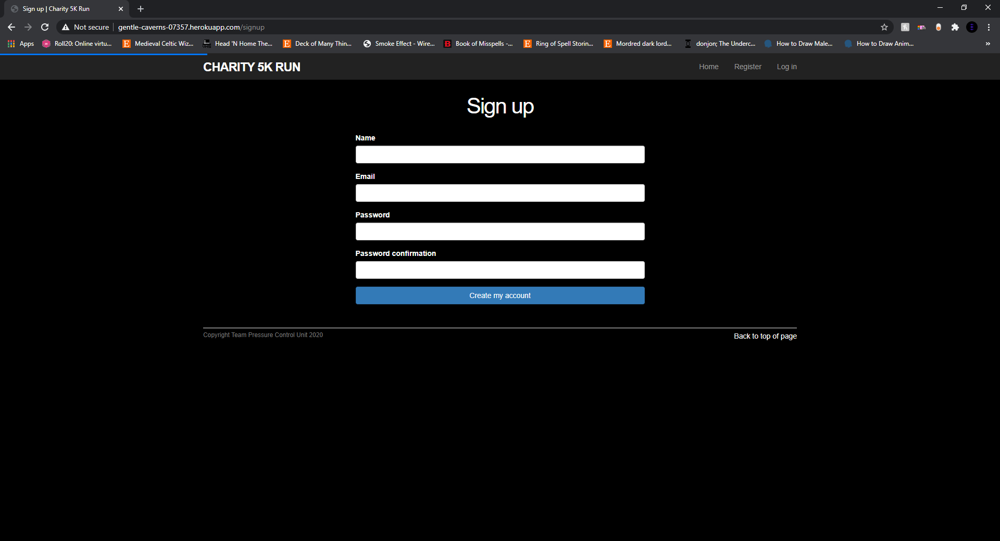
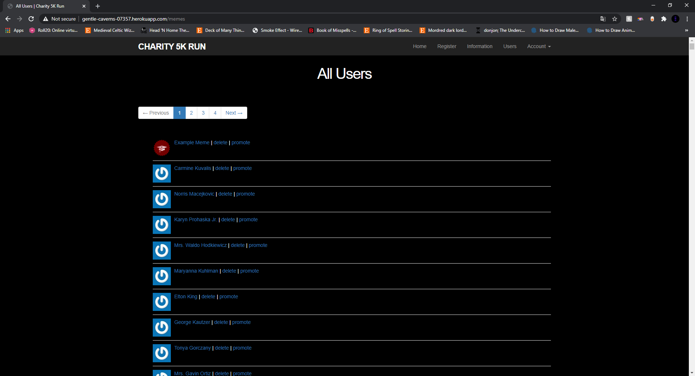
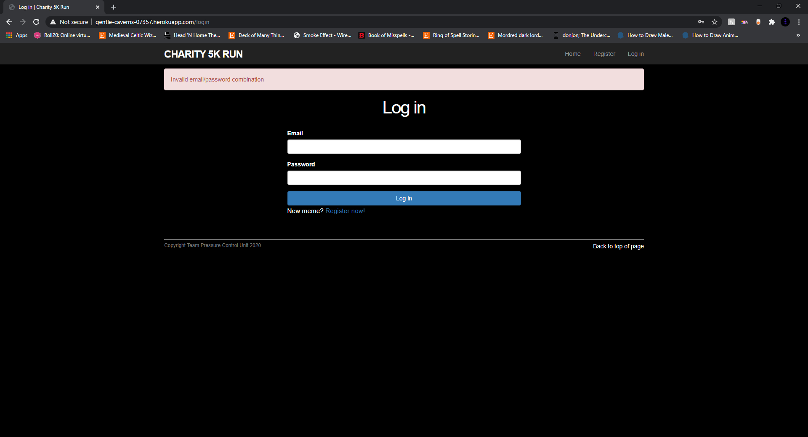
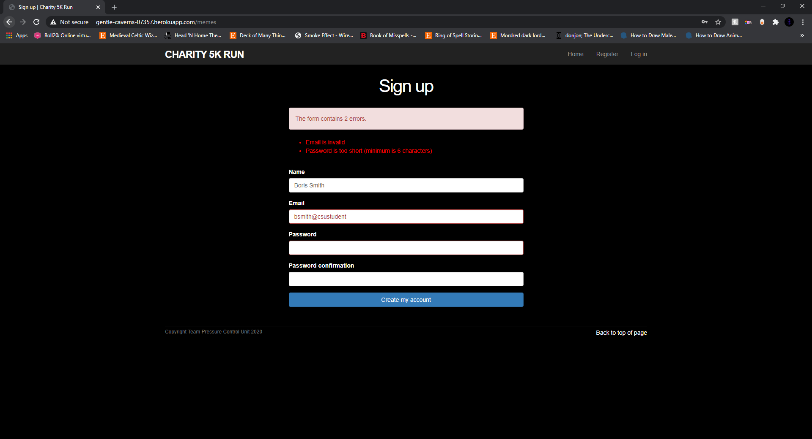
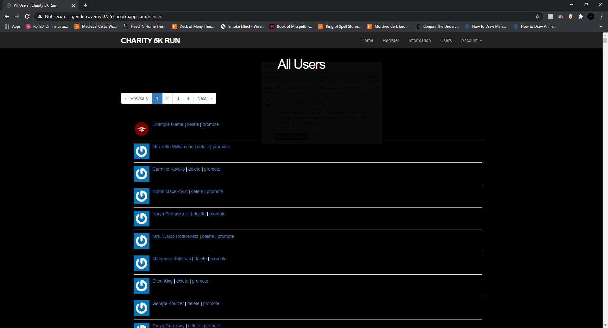
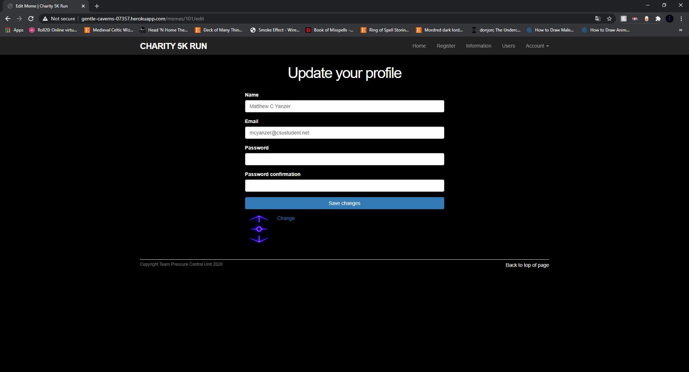
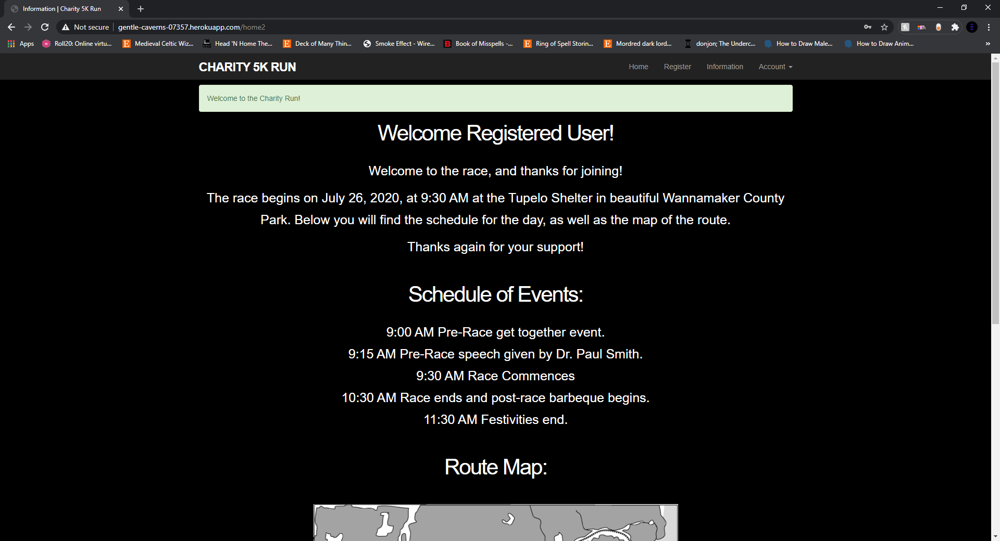

F[Back to Portfolio](./)

Website for Marathon Run Event
===============

-   **Class:** CSCI 334
-   **Grade:** A
-   **Language(s):** Ruby
-   **Source Code Repository:** [MattYanzer/Project1_Marathon_Website](https://github.com/MattYanzer/Project1_Marathon_Website)  
    (Please [email me](mailto:mcyanzer@csustudent.net?subject=GitHub%20Access) to request access. To view the code, you must switch to the master branch.)

## Project description

This project was made for a fictional marathon run event. The website would allow people to register for the race, join teams for the race, and inform both participants and observers about the event. The website would accommodate cross-platform, so people could comfortably navigate the website on both desktop and mobile device. Unfortunately, the team functionality was never added as our team ran out of time; however, everything else is fully functional.

## How to compile / run the program

How to compile and run the project.

To run this application: First, make sure to pull all code from GitHub into a subfolder within your file tree Next, run rails db:migrate in the command line to set up the database Run rails db:migrate:reset to remove any previous data stored in the database Finally, run db:seed to generate 1 initial admin and 99 users The admin login is example@railstutorial.org, password: foobar To access the site run rails server and preview the running application. From there you can create any new users, and use the default admin to promote any users

## UI Design

People visiting the website would first be greeted with a welcome page to the website (See Figure 1). From there they could either log in to the website or register an account, which would take the user to the pages displayed in Figure 2 and Figure 3, respectively. If a returning user is logging in, they are greeted with the page in Figure 4. Of course, if a user logs in with incorrect information, they are given an error message (See Figure 5). An error message will also be given to users registering for the race if any of their information cannot be used (See Figure 6). If a user is an admin, they can access the list of users registered for the race and have the option of deleting users and promoting users to admins (See Figure 7). There is also a settings page where the user can update their information (See Figure 8). When a new User is created, they are greeting with the information page and a notification welcoming them to the event. Unlike admins, users do not have access to the Users page (See Figure 9). The website is currently supported by heroku and can be visited with the following link. [Here is the website](http://gentle-caverns-07357.herokuapp.com/)

Fig 1. The Welcome Page

Fig 2. The Log In Page

Fig 3. The Register Page

Fig 4. Log In Welcome Page

Fig 5. Log In Error for an Incorrect Password

Fig 6. Register Error for an Incorrect Email and Short Password.

Fig 7. Users Page for Admins.

Fig 8. Settings Page.

Fig 9. New User Page.

[Back to Portfolio](./)
