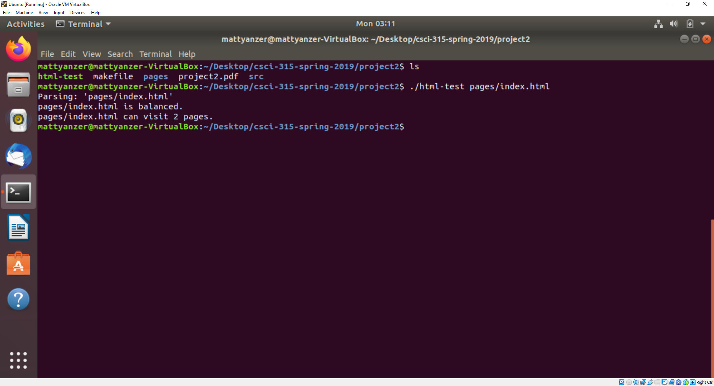
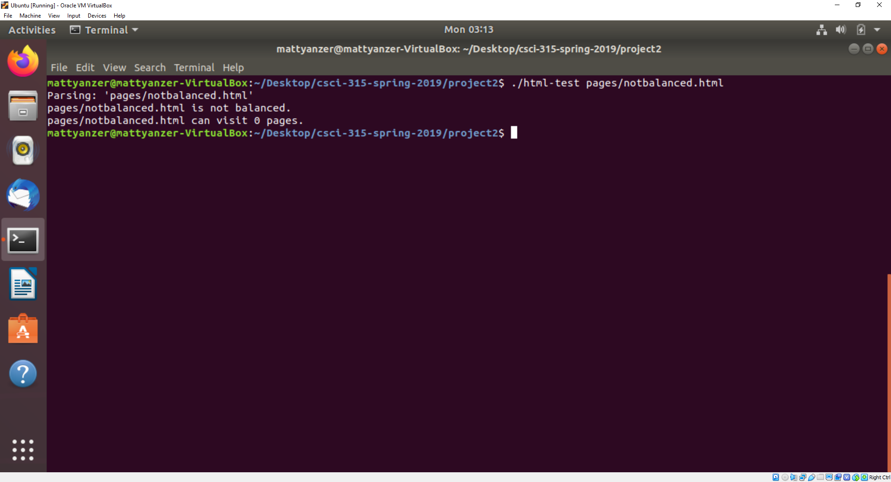
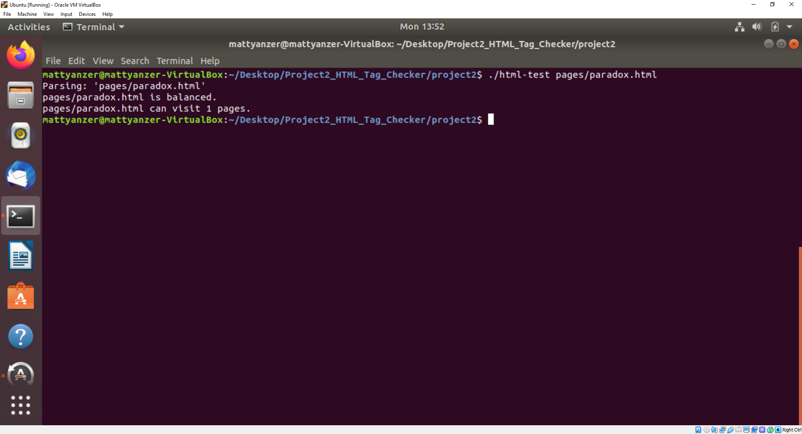
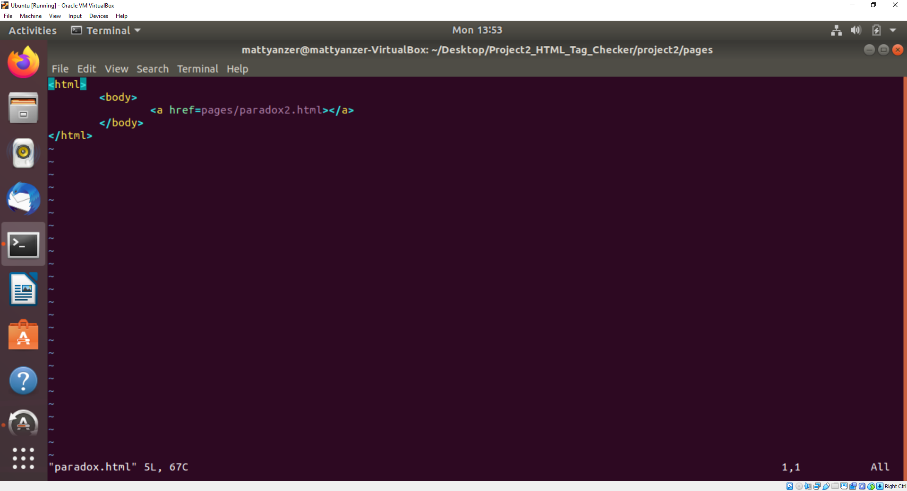
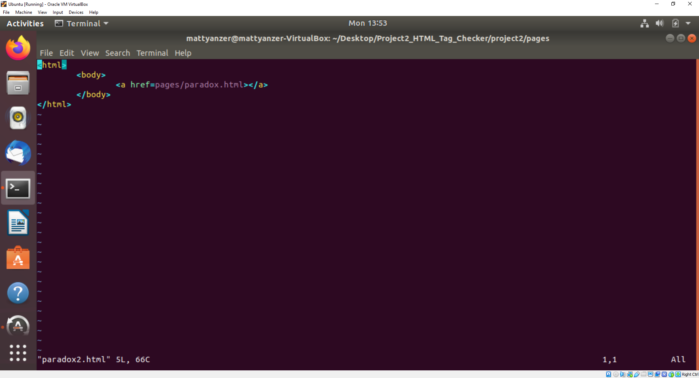
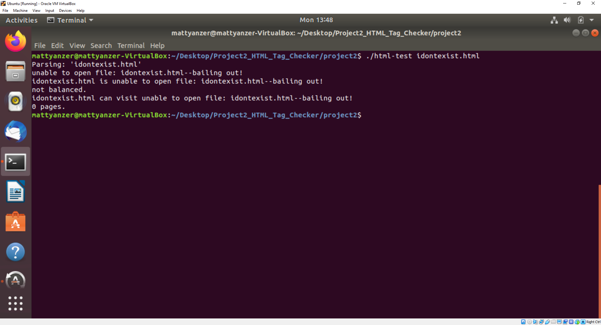
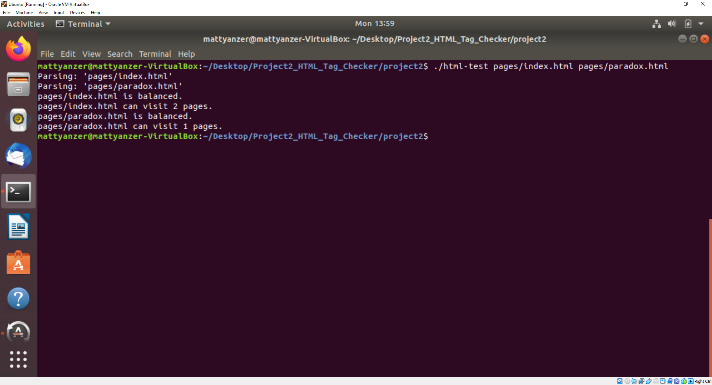

[Back to Portfolio](./)

HTML Tag Checker
===============

-   **Class:** CSCI 315
-   **Grade:** B
-   **Language(s):** C++
-   **Source Code Repository:** [MattYanzer/Project2_HTML_Tag_Checker](https://guides.github.com/MattYanzer/Project2_HTML_Tag_Checker)  
    (Please [email me](mailto:mcyanzer@csustudent.net?subject=GitHub%20Access) to request access.)

## Project description

The purpose of this project is to check HTML files to ensure that all tags used are in proper order and determines what the longest stream of non-repeating pages that can be accessed are.

## How to compile / run the program

In order to properly run the program, execute the below commands inside the project2 folder.
Make sure that you list the address of the file if it's not in the same file as project2.
For example, in order to run the index.html file in the pages folder, run the below code.

```bash
make
./html-test pages/index.html
```
The general format for running the program is as follows.

```bash
make
./html-test <file name here>
```

## UI Design

As afore-mentioned, this project has two purposes. The first purpose is to parse through html files and ensure that the file's tags are balanced, and the second purpose is to find how many unique pages that file can access. For the first purpose, the program utilizes a stack and pushes copies of the names of the tags into the stack. Any time an end tag is found, it is pushed onto the stack and the top two elements of the stack are compared to see if the top element (aka the end tag) matches the element beneath it (aka its supposed start tag). If the tags match, the two elements are popped off of the stack and the parsing continues until the end of the file. The file will be properly balanced if the stack is empty once the parsing finishes since every beginning tag will have been matched with its cooresponding end tag in the proper order. The program will then display a message stating that the file is balanced (See Figure 1). If the file is not balanced, the program will stop checking early and state that the file is not balanced (See Figure 2). After that, the program will then parse through the file again, this time looking for all links to other HTML files (aka pages) within the file. Anytime it finds a link, it adds it to a list and begins parsing through the new page, looking for links within it. The program continues to do this until there are no links left, and the program ignores duplicate links to avoid looping unnecessarily. To demonstrate, I included an example of the program running a file that links to another file that links back to the original file (See Figures 3a - 3c). Once the search is done, the program displays the number of pages that the file can visit (See Figure 1). If the file the program is asked to check cannot be found, the program ends early and displays an error message stating that the file cannot be found (See Figure 4). This program can also check multiple files at once so long as both files are listed when the program is run (See Figure 5).


Fig 1. Example output for a file that is properly balanced and that can visit two pages.


Fig 2. Example output for an improperly balanced file.


Fig 3a. Example output when checking the number of links for a program that links to a page that links to itself.


Fig 3b. The file being checked in Figure 3a.


Fig 3c. The file that Figure 3b's file points to. As you can see, it links back to the file in 3b, which could cause a loop in page searching  if the program did not keep track of every page previously visited.


Fig 4. Example output when an error occurs (file not found).


Fig 5. Example output when the program checks two files at the same time.

[Back to Portfolio](./)
