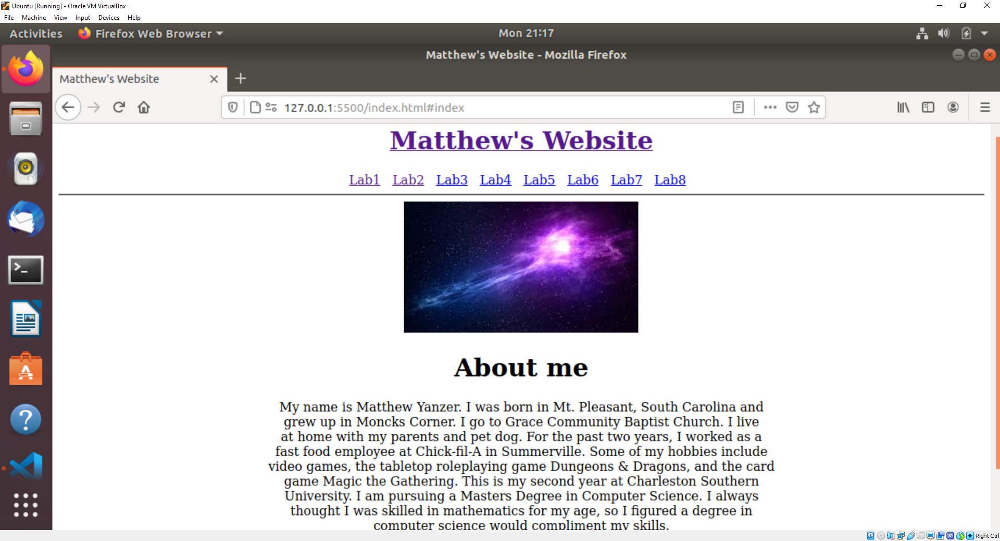
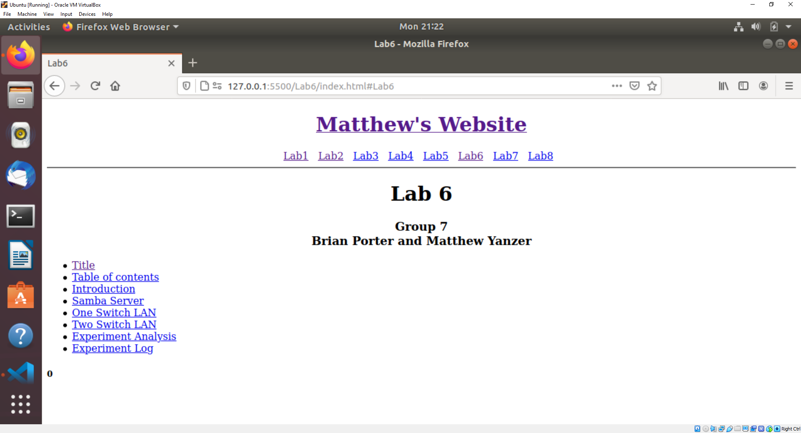
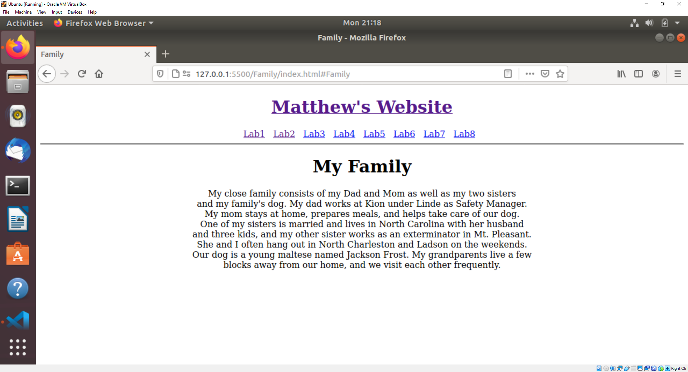
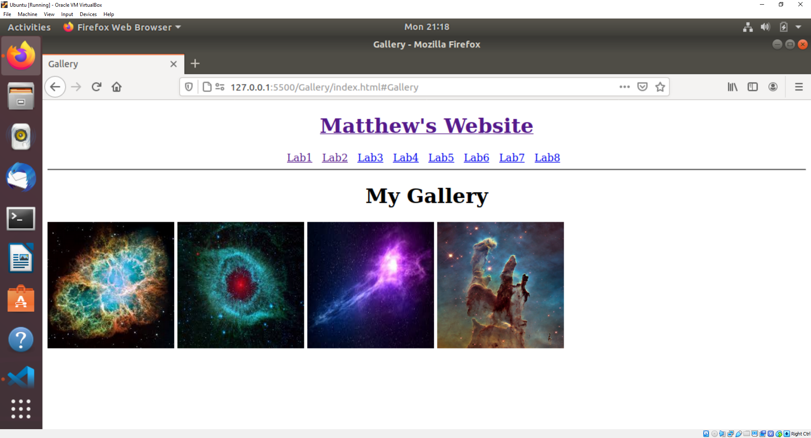

[Back to Portfolio](./)

Personal Website
===============

-   **Class:** CSCI 332
-   **Grade:** A
-   **Language(s):** HTML
-   **Source Code Repository:** [MattYanzer/Project3_Personal_Website](https://github.com/MattYanzer/Project3_Personal_Website)  
    (Please [email me](mailto:mcyanzer@csustudent.net?subject=GitHub%20Access) to request access.)

## Project description

This project is a website built in HTML that details some information about myself as well as some of the lab work I have done for CSCI 332. 

## How to compile / run the program

In order to run this project, download Visual Studio Code. From there, download the Live Server extension. Once that extension has downloaded, open the HOME PAGE folder in Visual Studio's editor, go to index.html inside HOME PAGE, and select "Go Live" on the status bar. From there you'll be able to navigate the website. The HOME PAGE folder needs to be removed from the Project3 folder before running the website as the HTML links are designed around HOME FOLDER being the base folder.

## UI Design

When the website is started, the user is taken to the home page (See Figure 1). From there, the user can navigate using the links on the page. The links are named such that the user can intuitively figure out where the link will take them. Clicking the header will redirect the user to the home page. From the home page, the user can access the labs I worked on in CSCI 332, an example of which is shown in Figure 2. The user can also navigate to a page detailing some basic information about my family or to a page displaying a gallery of cool pictures (See Figures 3 and 4, respectively). 

Fig 1. The Home Page

Fig 2. Example Lab Page (Lab06 specifically)

Fig 3. The Family Page

Fig 4. The Gallery Page

[Back to Portfolio](./)
