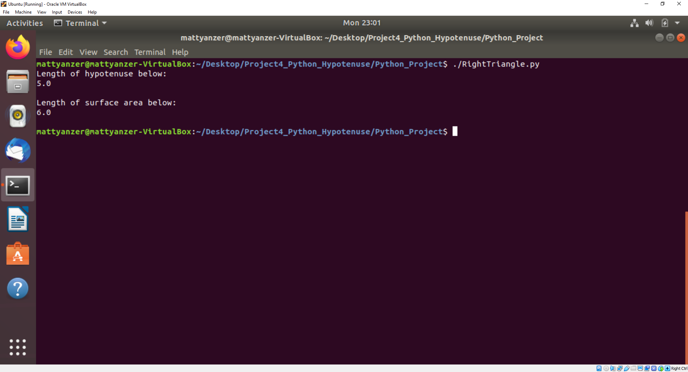

[Back to Portfolio](./)

Python_Hypotenuse
===============

-   **Class:** CSCI 301 
-   **Grade:** A
-   **Language(s):** Python
-   **Source Code Repository:** [MattYanzer/Project4_Python_Hypotenuse](https://github.com/MattYanzer/Project4_Python_Hypotenuse)  
    (Please [email me](mailto:mcyanzer@csustudent.net?subject=GitHub%20Access) to request access.)

## Project description

This project entails a Python program that calculates the length of a hypotenuse given the length of the other two sides of a hypothetical triangle as well as the surface area of said triangle.

## How to compile / run the program

Navigate to where the folder is located and execute these commands on your terminal.

```bash
./RightTriangle.py
```

## UI Design

As previously stated, this project calculates the hypotenuse of a triangle given the triangle's other two sides. In addition, it calculates the surface area of the triangle.


Fig 1. An example output where the given sides were of lengths 3 and 4.

[Back to Portfolio](./)
